# Windows Security Assessment & Active Directory Hardening Lab

## Présentation

Ce projet consiste en la construction, la configuration, la sécurisation et la supervision d'un environnement Windows Server basé sur Active Directory.

Le projet a été réalisé progressivement dans un environnement de laboratoire isolé. L'objectif était de construire et configurer les composants, de mettre en place des mécanismes de sécurité, de tester leur fonctionnement, puis d'ajouter des contrôles de journalisation, de détection et d'automatisation.

La démarche suivie est :

**Build → Configure → Secure → Harden → Validate → Monitor → Detect → Automate**

Le projet couvre notamment :

- Windows Server Security
- Active Directory Security
- IAM et gestion des privilèges
- Group Policy
- Password Policy et Account Lockout
- Windows Server Hardening
- SMB Security
- Windows Defender Firewall
- Remote Administration Security
- Security Logging
- Authentication Monitoring
- Detection Engineering
- PowerShell Security Automation


---

## 1. Lab Environment

### Domaine

```text
Domain: cyberlab.local
Domain Controller: DC01
Client: CLIENT01
```

### Architecture générale

```text
                         cyberlab.local
                                |
                         +--------------+
                         |     DC01     |
                         | Windows      |
                         | Server      |
                         | AD DS / DNS |
                         +--------------+
                                |
                         +--------------+
                         |   CLIENT01   |
                         |   Windows    |
                         |    Client    |
                         +--------------+
```

Le laboratoire a été construit comme un environnement Windows/Active Directory permettant de pratiquer l'administration, la configuration de sécurité, le hardening, la validation et le monitoring.

---

## 2. Active Directory Deployment & Configuration

Le domaine Active Directory `cyberlab.local` a été configuré autour du Domain Controller `DC01`.

Cette phase a permis de mettre en place :

- Active Directory Domain Services ;
- DNS associé au domaine ;
- utilisateurs ;
- groupes de sécurité ;
- Organizational Units (OU) ;
- Group Policy Objects (GPO) ;
- organisation des ressources par fonction ;
- gestion des privilèges et des accès.

### Organizational Units

L'environnement Active Directory a été organisé avec plusieurs OU dédiées, notamment :

```text
Comptabilité
Direction
Domain Controllers
Groupes
IT
Postes
RH
Serveurs
Utilisateurs
```

Cette organisation permet de séparer les objets selon leur rôle et de faciliter l'application ciblée des politiques de sécurité.

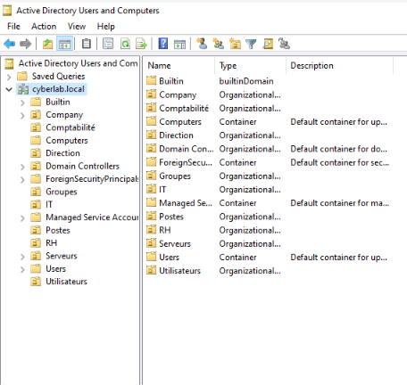

---

## 3. Group Policy & Security Policies

Les Group Policy Objects ont été créés et configurés pour mettre en place les politiques de sécurité du domaine.

Parmi les GPO configurées et liées au domaine :

```text
Politique de mots de passe et verrouillage des comptes
Politique de sécurité des postes clients
```

Les GPO étaient activées et leurs liens vers le domaine étaient actifs.

Cette partie du Lab a permis de travailler sur :

- Password Policy ;
- Account Lockout Policy ;
- Security Policy des postes clients ;
- gestion centralisée des paramètres de sécurité ;
- application des politiques au niveau du domaine.

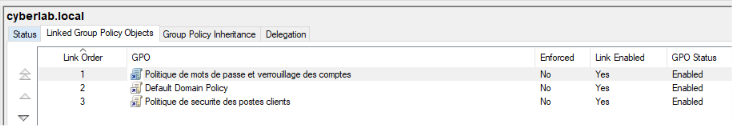

### Password Policy & Account Lockout

Une GPO dédiée a été créée pour centraliser les paramètres liés aux mots de passe et au verrouillage des comptes.

Cette politique permet de travailler sur des contrôles tels que :

- complexité des mots de passe ;
- durée et renouvellement ;
- historique des mots de passe ;
- seuil de verrouillage ;
- durée de verrouillage ;
- réinitialisation du compteur de verrouillage.

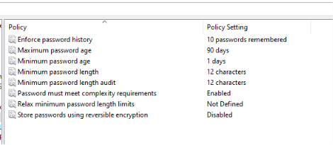

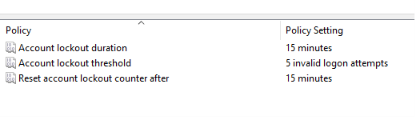

---

## 4. Identity & Access Management

Une partie importante du Lab concerne la gestion des identités et des accès.

Des groupes distincts ont été utilisés pour séparer les rôles :

```text
GG_IT
GG_IT_Admins
GG_Direction
```

Les utilisateurs ont ensuite été associés aux groupes correspondant à leurs responsabilités.

### Exemple : compte privilégié

Le compte `Thomas.Martin` appartient notamment à :

```text
Domain Users
GG_IT
GG_IT_Admins
```

Le compte dispose ainsi d'un rôle d'administration technique dans le Lab.

Vérification :

```powershell
Get-ADPrincipalGroupMembership "Thomas.Martin" |
Select-Object Name
```

### Exemple : compte Direction

Le compte `Nicolas.Moreau` appartient à :

```text
Domain Users
GG_Direction
```

Vérification :

```powershell
Get-ADPrincipalGroupMembership "Nicolas.Moreau" |
Select-Object Name
```

### Groupe privilégié

Le contenu du groupe `GG_IT_Admins` a été vérifié :

```powershell
Get-ADGroupMember "GG_IT_Admins" |
Select-Object Name, SamAccountName
```

Résultat obtenu :


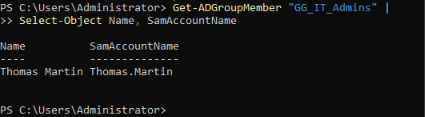

---

## 5. Access Control & Separation of Duties

Le Lab comprend un scénario de **Separation of Duties (SoD)** afin de séparer une fonction technique d'une fonction de validation.

Le principe est :

```text
Technical execution
        ≠
Business approval
```

Thomas Martin représente le rôle technique avec des privilèges IT.

Nicolas Moreau représente le rôle de Direction et ne possède pas les privilèges d'administration IT.

Un scénario de demande de changement a été utilisé pour représenter le processus :

```text
Thomas
   |
   | Change Request
   v
Validation
   |
   v
Nicolas / Direction
```

Le Lab a également permis de tester la séparation d'accès à une ressource SMB dédiée au scénario SoD.

Cette partie permet de travailler sur :

- Separation of Duties ;
- Least Privilege ;
- Privileged Access ;
- validation des opérations sensibles ;
- contrôle des accès aux ressources.

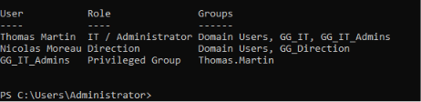

---

## 6. SMB Security

Le protocole SMB a été vérifié.

La configuration a été contrôlée avec :

```powershell
Get-SmbServerConfiguration |
Select-Object EnableSMB1Protocol,
              EnableSMB2Protocol,
              EnableSecuritySignature,
              RequireSecuritySignature
```

Résultat :

```text
EnableSMB1Protocol        False
EnableSMB2Protocol        True
EnableSecuritySignature   True
RequireSecuritySignature  True
```

Les mesures appliquées permettent de :

- désactiver SMBv1 ;
- conserver SMBv2/SMB3 ;
- activer SMB Signing ;
- rendre SMB Signing obligatoire.

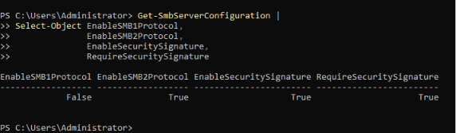

---

## 7. Windows Defender Firewall

Windows Defender Firewall a été configuré et vérifié comme composant majeur de la sécurité réseau du serveur.

Les profils ont été configurés puis vérifiés :

```powershell
Get-NetFirewallProfile |
Select-Object Name,
              Enabled,
              DefaultInboundAction,
              DefaultOutboundAction
```

Les profils suivants ont été vérifiés :

```text
Domain
Private
Public
```

Les règles entrantes autorisées ont ensuite été étudiées afin d'identifier les services accessibles.

Une attention particulière a été portée aux règles liées à :

- Active Directory ;
- DNS ;
- Kerberos ;
- SMB ;
- RPC ;
- WMI ;
- WinRM ;
- DFS ;
- File and Printer Sharing.

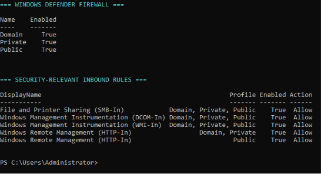

---

## 8. Windows Services Hardening

Les services Windows ont été recensés puis étudiés afin d'identifier les composants réellement nécessaires au fonctionnement du serveur.

Commande utilisée :

```powershell
Get-Service |
Where-Object {
    $_.Status -eq "Running"
} |
Sort-Object DisplayName |
Select-Object DisplayName, Name, StartType
```

Une attention particulière a été portée à :

- Active Directory Domain Services ;
- DNS ;
- Kerberos ;
- Netlogon ;
- RPC ;
- SMB ;
- Windows Event Log ;
- Windows Defender ;
- WinRM ;
- Print Spooler ;
- DFS ;
- WMI.

L'approche retenue consiste à ne pas désactiver un service uniquement parce qu'il est actif : son rôle et ses dépendances doivent d'abord être compris.

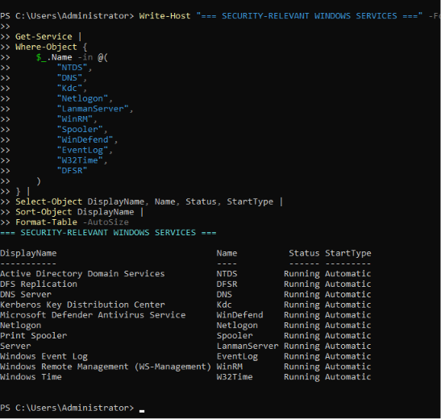

---

## 9. Print Spooler Review

Le service Print Spooler a été contrôlé :

```powershell
Get-Service Spooler |
Select-Object Name, Status, StartType
```

Résultat :

```text
Name      Status   StartType
Spooler   Running  Automatic
```

Les imprimantes présentes ont également été vérifiées :

```powershell
Get-Printer |
Select-Object Name, Shared, Published
```


Le service a donc été identifié comme un élément de surface d'attaque à évaluer, sans désactivation aveugle.

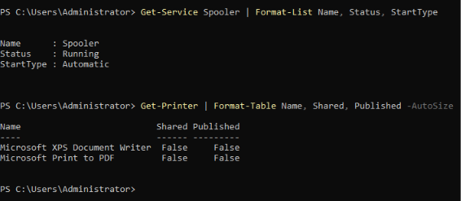

---

## 10. WinRM & Remote Administration Security

WinRM a été analysé comme mécanisme d'administration distante Windows.

Vérification du service :

```powershell
Get-Service WinRM |
Select-Object Name, Status, StartType
```

Le service était :

```text
Running
Automatic
```

La configuration du listener a été vérifiée :

```powershell
winrm enumerate winrm/config/listener
```

Le Lab présentait notamment :

```text
Transport = HTTP
Port = 5985
Enabled = true
Address = *
```

L'écoute réseau réelle a ensuite été vérifiée :

```powershell
Get-NetTCPConnection -LocalPort 5985 -State Listen |
Select-Object LocalAddress, LocalPort, State, OwningProcess
```

Résultat :

```text
LocalAddress = ::
LocalPort    = 5985
State        = Listen
```

Le processus propriétaire était le processus système Windows.

Les règles Firewall liées à WinRM ont également été contrôlées :

```powershell
Get-NetFirewallRule -DisplayName "*Windows Remote Management (HTTP-In)" |
Select-Object DisplayName, Enabled, Profile, Direction, Action
```

Les adresses distantes autorisées ont été vérifiées afin d'identifier le niveau d'exposition du service.

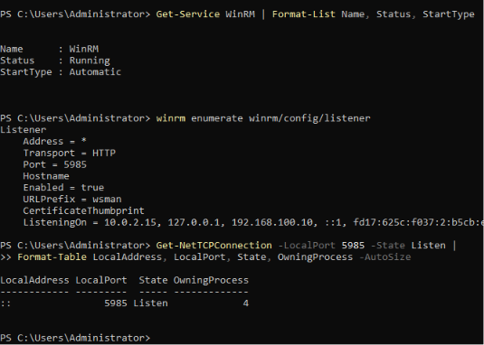

---

## 11. Security Logging

Une partie dédiée au Security Monitoring a été mise en place.

Un répertoire de travail a été créé :

```powershell
New-Item -ItemType Directory `
-Path "C:\CyberLab\SecurityLogs" `
-Force
```

Les événements Windows Security correspondant à l'Event ID `4625` ont été collectés.

Le fichier brut a été créé :

```text
C:\CyberLab\SecurityLogs\FailedLogons.csv
```

Export réalisé :

```powershell
Get-WinEvent -FilterHashtable @{
    LogName = 'Security'
    Id = 4625
} -MaxEvents 100 |
Export-Csv "C:\CyberLab\SecurityLogs\FailedLogons.csv" `
-NoTypeInformation `
-Encoding UTF8
```

---

## 12. Event ID 4625 Analysis

Les événements `4625` ont ensuite été parsés afin d'extraire les informations importantes de `EventData`.

Les champs structurés comprennent :

```text
Time
User
Domain
LogonType
SourceIP
Workstation
Status
SubStatus
Process
```

Le résultat a été exporté dans :

```text
C:\CyberLab\SecurityLogs\FailedLogons_Analysis.csv
```

Des événements locaux ont notamment été observés avec `127.0.0.1`, tandis que des événements de type `LogonType 3` ont été observés depuis `192.168.100.20`.

### Logon Type 3

Le `LogonType 3` correspond à une authentification de type **Network**.

Dans le contexte du Lab, cette information permet de distinguer les authentifications réseau des ouvertures de session locales et d'orienter la détection vers les tentatives d'accès réseau.

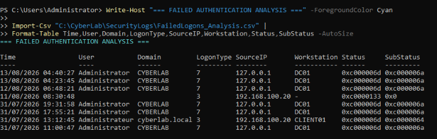

---

## 13. Detection Engineering with PowerShell

Une première logique de détection a été développée afin d'identifier plusieurs échecs d'authentification réseau provenant d'une même adresse IP.

La logique appliquée est :

```text
Event ID 4625
       |
       v
LogonType = 3
       |
       v
SourceIP disponible
       |
       v
Exclusion de 127.0.0.1
       |
       v
Groupement par SourceIP
       |
       v
Count >= 2
       |
       v
Security Alert
```

Le script a détecté :

```text
SourceIP       FailedAttempts
192.168.100.20 2
```

avec :

```text
Multiple network authentication failures
```

Cette logique constitue une première approche de Detection Engineering à partir des Windows Security Logs.

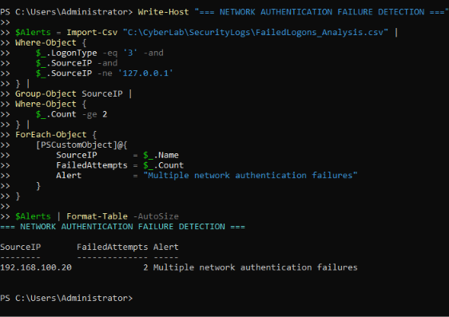

---

## 14. Automated Security Alert

Les alertes ont été exportées automatiquement dans :

```text
C:\CyberLab\SecurityLogs\Alerts.csv
```

Export :

```powershell
$Alerts |
Export-Csv "C:\CyberLab\SecurityLogs\Alerts.csv" `
-NoTypeInformation `
-Encoding UTF8
```

Contenu obtenu :

```text
"SourceIP","FailedAttempts","Alert"
"192.168.100.20","2","Multiple network authentication failures"
```

Cette étape transforme les événements bruts en résultat exploitable pour un analyste sécurité.

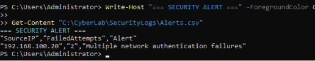

---

## 15. Security Monitoring Workflow

Le workflow développé dans le Lab peut être résumé ainsi :

```text
Windows Security Logs
        |
        v
Event ID 4625
        |
        v
PowerShell
        |
        v
XML Parsing
        |
        v
Structured Data
        |
        v
Filtering
        |
        v
Source IP Grouping
        |
        v
Detection Rule
        |
        v
Security Alert
        |
        v
CSV Reporting
```

Cette partie permet de travailler concrètement sur :

- Security Logging ;
- Log Analysis ;
- Authentication Monitoring ;
- Detection Engineering ;
- Security Automation ;
- Alert Generation.

---

## 16. Security Validation

Une fois les composants configurés et les mesures de sécurité appliquées, leur état a été vérifié avec PowerShell et les outils natifs de Windows.

Les contrôles réalisés ont notamment porté sur :

- Active Directory ;
- Organizational Units ;
- Group Policy ;
- Password Policy ;
- Account Lockout Policy ;
- group memberships ;
- privileged groups ;
- Separation of Duties ;
- Windows Defender Firewall ;
- SMB configuration ;
- SMB Signing ;
- Windows Services ;
- Print Spooler ;
- WinRM ;
- listening ports ;
- Security Event Logs ;
- authentication failures.

La démarche retenue est :

**Configuration → Validation → Analyse → Recommandation**

---

## 17. Security Findings & Recommendations

### Active Directory & IAM

- contrôler régulièrement les memberships des groupes privilégiés ;
- appliquer le principe du moindre privilège ;
- maintenir une séparation claire des rôles ;
- revoir régulièrement les comptes et groupes sensibles.

### Group Policy

- centraliser les Password Policy et Account Lockout Policy ;
- maintenir les politiques de sécurité des postes clients ;
- contrôler régulièrement les GPO liées au domaine ;
- vérifier les changements de configuration.

### SMB

- maintenir SMBv1 désactivé ;
- maintenir SMB Signing activé et requis ;
- limiter les accès SMB aux utilisateurs et machines autorisés.

### Windows Defender Firewall

- limiter les règles aux flux nécessaires ;
- revoir régulièrement les règles d'administration distante ;
- éviter les sources inutilement larges.

### WinRM

Le Lab a montré qu'un listener WinRM est actif sur TCP/5985 et que les règles Firewall associées doivent être considérées comme une surface d'administration distante.

Recommandations :

- limiter WinRM aux sources d'administration nécessaires ;
- contrôler régulièrement les règles Firewall associées ;
- éviter une exposition plus large que nécessaire.

### Security Monitoring

- conserver les événements de sécurité importants ;
- surveiller les échecs d'authentification ;
- corréler les événements provenant d'une même source ;
- étendre progressivement les règles de détection.

---

## 18. Skills Demonstrated

### Active Directory & IAM

- Active Directory Domain Services
- Domain administration
- Organizational Units
- Group Policy
- User and Group Management
- Privileged Groups
- IAM fundamentals
- Least Privilege
- Separation of Duties
- Password Policy
- Account Lockout Policy

### Windows Security

- Windows Server Security
- Windows Defender Firewall
- SMB Security
- SMBv1 Hardening
- SMB Signing
- Windows Services Review
- Print Spooler Security Review
- WinRM Security
- Remote Administration Security

### Security Monitoring & Detection

- Windows Security Event Logs
- Event ID 4625
- Logon Type analysis
- Network authentication monitoring
- Source IP analysis
- Detection rules
- Alert generation

### Automation

- PowerShell
- XML event parsing
- Security log extraction
- CSV reporting
- Automated filtering
- Event grouping
- Security alert generation

---


## 20. Project Outcome

Ce Lab m'a permis de travailler sur l'ensemble du cycle de sécurisation d'un environnement Windows/Active Directory :

```text
Build
  ↓
Active Directory Deployment
  ↓
Users / Groups / OUs
  ↓
Group Policy
  ↓
IAM / Privileged Access
  ↓
Security Configuration
  ↓
Hardening
  ↓
Validation
  ↓
Security Logging
  ↓
Detection
  ↓
PowerShell Automation
  ↓
Security Recommendations
```

L'intérêt principal du projet est d'avoir réalisé et configuré l'environnement avant de procéder aux phases d'assessment et de validation.

Le Lab démontre ainsi à la fois des compétences de configuration et d'administration et des compétences de cybersécurité :

- construire un environnement ;
- configurer les identités et les politiques ;
- appliquer des mesures de hardening ;
- contrôler les privilèges ;
- vérifier la configuration ;
- analyser les événements ;
- automatiser une détection ;
- documenter les résultats.

---

## 21. Relevance to Cybersecurity Roles

Les compétences développées dans ce projet peuvent être transposées à plusieurs missions junior :

- Security Analyst
- Windows Security
- Active Directory Security
- IAM Analyst
- Security Operations
- Security Engineering
- Detection Engineering
- SOC Analyst
- Cybersecurity Consulting

---

## Conclusion

Ce projet met en pratique la sécurisation d'un environnement Windows Server et Active Directory, depuis la construction et la configuration de l'infrastructure jusqu'au hardening, à la validation, au Security Monitoring, à la détection et à l'automatisation.

Le Lab combine :

**Active Directory → IAM → Group Policy → Hardening → Security Validation → Security Logging → Detection → PowerShell Automation**

Il constitue une base pratique pour les domaines de la sécurité des systèmes, de l'IAM, du SOC, de la Security Engineering et de la Detection Engineering.
